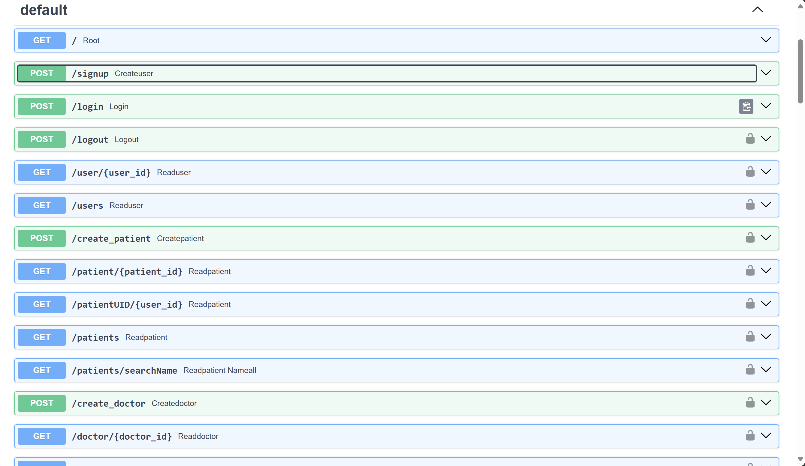

# Digi Sehat API
Sebuah Api untuk adalah backend sistem yang dirancang untuk mengelola data kesehatan. Dibangun dengan FastAPI, proyek ini menyediakan endpoints untuk autentikasi pengguna, manajemen data dokter, pasien, dan obat.


## Daftar Isi
- [Tumpukan Teknologi](#tumpukan-teknologi)
- [Fitur](#fitur)
- [Dokumentasi Halaman](#dokumentasi-halaman)
- [Cara Instalasi](#cara-instalasi)
- [Cara Penggunaan](#cara-penggunaan)

## Tumpukan Teknologi
### Bahasa Pemograman
- **Python**: Bahasa pemrograman yang serbaguna dan mudah dipelajari, sering digunakan untuk pengembangan web, analisis data, kecerdasan buatan, dan automasi skrip

### API
- **Restful API**: gaya arsitektur perangkat lunak yang didasarkan pada prinsip-prinsip REST (Representational State Transfer). RESTful API dirancang untuk memfasilitasi komunikasi antara sistem-sistem yang berbeda secara efisien dan terstruktur menggunakan protokol HTTP.

- **Fast APi**:  kerangka kerja Python yang dirancang untuk membangun aplikasi web API dengan cepat.

### DBMS
- **SQLite**: sebuah sistem manajemen basis data relasional yang bersifat self-contained, serverless, zero-configuration, dan transaksional. 

## Fitur
- Melihat semua data pasien
- Membuat pasien
- Update data pasien
- Delete pasien
- Selain pasien perintah dapat digunakan untuk dokter, obat, dan lainnya

## Dokumentasi Halaman
##### 1. Halaman Utama

##### 2. Halaman Skema API

##### 3. Halaman List APInya


## Cara Instalasi
```bash
# Pastikan Python 3.6+ sudah terinstal pada sistem Anda. Anda juga perlu pip untuk mengelola pustaka Python.

# Clone repository ini
git clone https://github.com/defrijay/digi-sehat.git

# Masuk ke direktori proyek
cd digi-sehat
git checkout python

# Instal semua dependencies yang diperlukan dengan pip
pip install -r requirements.txt

# Jalankan server FastAPI menggunakan uvicorn
python -m uvicorn main:app --reload

# Masuk dengan url server
http://127.0.0.1:8000/docs

```

## Cara Penggunaan
Setelah server berjalan, Anda bisa mengakses dokumentasi API di http://127.0.0.1:8000/docs yang menyediakan antarmuka Swagger untuk mencoba API secara langsung.

